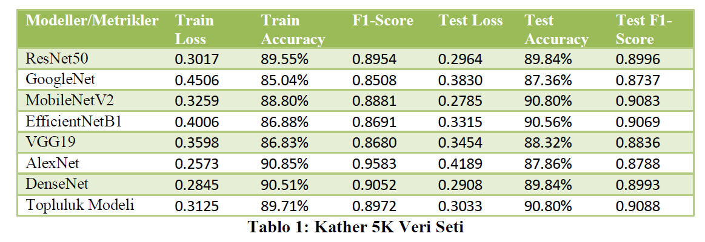
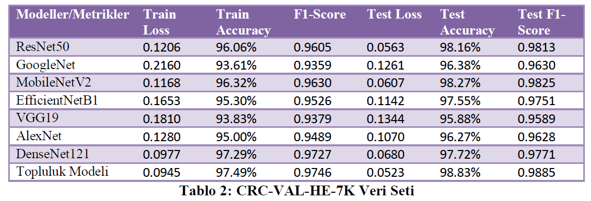
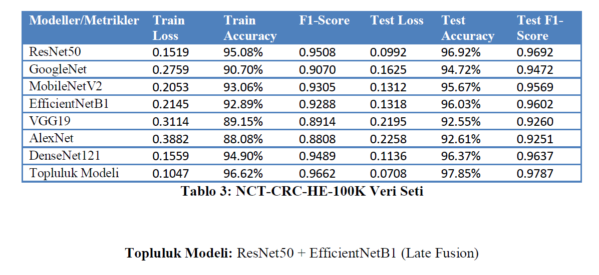

# Colorectal-Cancer-Diagnosis-Model-with-CNN
This is a TUBITAK 2209 project to compare existing CNN architectures and develop a proposed ensemble model for the detection of colorectal cancer from colon histopathological images. Pycharm, Jupyter Notebook, and Pytorch were used. The project is complete and is currently being developed into an academic publication.

## Datasets
Three different data sets were used in the project.
1. Kather Texture 5000 Image
2. CRC-VAL-HE 7000 Image
3. NCT-CRC-HE 100.000 Image

## Authors 
- Kerem Okur
- Fatmanur Güngör

## Results

  
  
  

